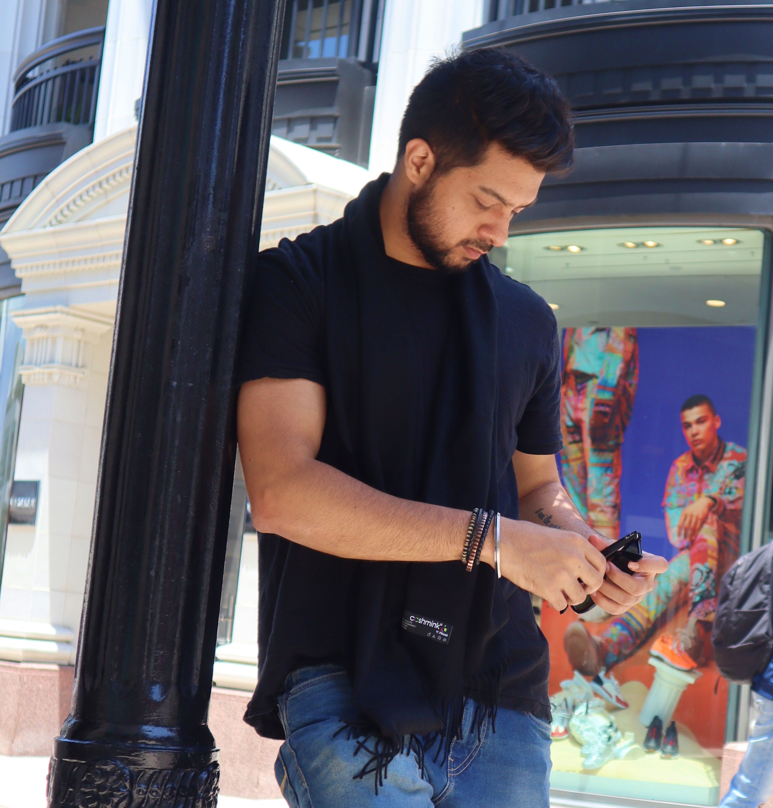

 
 
Hello folks,

I will be demonstrating the learnings from CSCI 5839, in a series of blog posts I will be sharing here. 

1. [Reading Assignment 1](assignment1.md)

2. [Reading Assignment 2: Personas](assignment2Personas.md)

3. [Reading Assignment 2: Task Analysis](assignment2taskAnalysis.md)

4. [Reading Assignment 3: Formative Research](assignment3FormativeResearch.md)

5. [Assignment 5: Sketches](assignment5Sketching.md)

6. [Assignment 6: Prototyping](assignment6Prototyping.md)

Kamal
